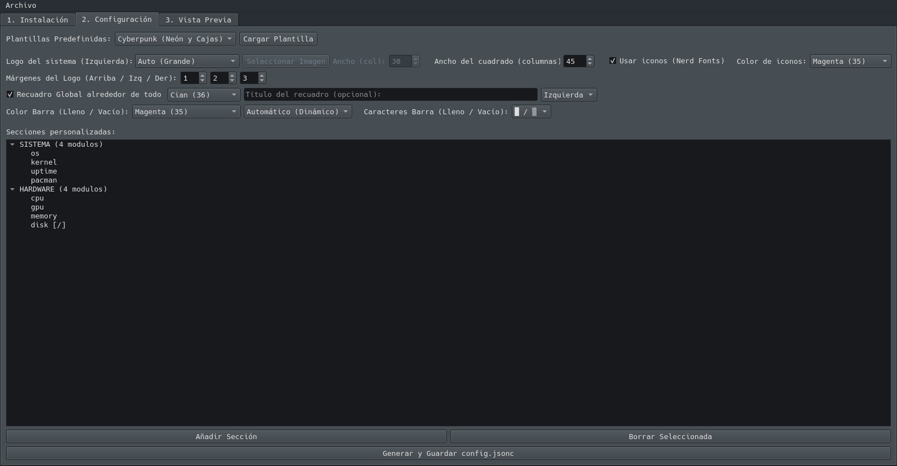

<div align="center">

<br>

# ⚡ Fastfetch Configurator

**A powerful, intuitive GUI to design, preview and deploy your `fastfetch` configuration — without touching a single line of JSON.**

<br>



<br>

[](https://www.python.org/)
[](https://pypi.org/project/PyQt6/)
[](https://github.com)
[](LICENSE)
[]()

</div>

---

## 🗂 Table of Contents

- [About](#-about)
- [Features](#-features)
- [Requirements](#-requirements)
- [Installation](#-installation)
- [Usage](#-usage)
- [Contact](#-contact)

---

## 📌 About

**Fastfetch Configurator** is a cross-platform desktop application built with Python and PyQt6 that provides a full graphical interface for managing [fastfetch](https://github.com/fastfetch-cli/fastfetch) configurations.

Instead of manually editing complex `.jsonc` files, you can visually design your system info display — with real-time previews, section grouping, color theming, Nerd Font icons, custom modules and much more — and export a ready-to-use configuration in one click.

---

## ✨ Features

<br>

### 🧩 Visual Section Builder
Create and manage fully customizable sections with drag-and-drop module ordering. Each section supports independent color schemes, tree-mode rendering (`├─ └─`), closed box framing, and custom icons using Nerd Fonts.

---

### 🎨 Full Color Theming
Assign individual ANSI colors to section titles, module values, icons, and progress bar fills. Supports all standard ANSI color codes (31–37, 90) and dynamic automatic color assignment.

---

### 📦 50+ Supported Modules
Add system information modules organized by category — including System Base, Hardware, Resources, Display & Graphics, Desktop Environment, Terminal & Console, Network & Internet, Peripherals, Multimedia, and Filesystems. Each module includes a descriptive tooltip for easy identification.

---

### 🌳 Module Tree with Tooltip Descriptions
A categorized, collapsible tree widget lists every available fastfetch module with human-readable descriptions. Double-click or use the Add button to include them in any section.

---

### 🔧 Per-Module Configuration
Each module can be individually configured with a custom display name, advanced format strings (e.g. `{1} / {2}`), independent icon color, and — where supported — a visual progress bar (CPU usage, RAM, Swap, Battery, Disk, Brightness, Player).

---

### 👁 Live In-App Preview
Switch to the Preview tab to instantly render your current configuration through fastfetch, with full ANSI-to-HTML conversion and dark terminal styling. Nerd Font icons are preserved correctly.

---

### 🖥 Real Terminal Launch
Open the current configuration directly in your native terminal emulator (Konsole, GNOME Terminal, XFCE4 Terminal, Alacritty, Kitty, xterm) to see the exact final output. Supports Linux, Windows (`cmd`) and macOS (`Terminal.app`).

---

### 🖼 Custom Image / Logo Support
Replace the default distro logo with a custom image. The logo position, size (Auto / Small / Hidden), and padding (top, left, right) are fully configurable with live spinbox controls.

---

### 🗃 Predefined Templates
Load professional ready-made presets to get started instantly: **Cyberpunk** (neon colors + boxes), **Minimalist** (no borders, clean layout), and **Mac-Style** (elegant and compact). Templates can be loaded at any time without losing previous work (confirmation required).

---

### 💾 Save & Load Configurations
Export your full configuration as a `.jsonc` file compatible with fastfetch, or reload any previously saved configuration. An internal `$gui_config` block preserves all GUI state so your layout can be re-edited at any time.

---

### 🔁 bashrc / zshrc Integration
Enable a toggle to automatically run fastfetch when opening a terminal by injecting a call into your `.bashrc` or `.zshrc`. The app detects which shell profile exists and confirms before making any changes.

---

### 📦 Built-in fastfetch Installer
If fastfetch is not detected on the system, the app offers a one-click installation: using `winget` on Windows, `brew` on macOS, or `pkexec apt install` on Linux — no terminal required.

---

### 🌍 Automatic Language Detection
The interface automatically switches between **Spanish** and **English** based on the system locale. All labels, tooltips, dialogs, and messages are fully translated via a lightweight runtime translation engine.

---

### ⚙️ Global Box Decoration
Wrap the entire fastfetch output in a styled global box with optional title text and left/center/right alignment — perfect for a polished, framed terminal aesthetic.

---

### 🍫 Progress Bar Customization
Choose the fill and empty characters for all progress bars (blocks, dots, pipes, arrows…) and their respective ANSI colors — with both static and dynamic automatic color modes.

---

## 📋 Requirements

```
Python >= 3.10
PyQt6
ansi2html
fastfetch (auto-installable from the app)
Nerd Fonts (recommended for full icon support)
```

Install Python dependencies:

```bash
pip install PyQt6 ansi2html
```

---

## 🚀 Installation

```bash
# Clone the repository
git clone https://github.com/AnabasaSoft/fastfetch-configurator.git
cd fastfetch-configurator

# Install dependencies
pip install PyQt6 ansi2html

# Run
python main.py
```

> **Note:** On Linux, `pkexec` is required to install fastfetch via the GUI. On Windows, `winget` must be available.

---

## 🧪 Usage

1. **Tab 1 — Installation:** Check if fastfetch is installed. Install it if needed, and optionally enable auto-launch on terminal start.
2. **Tab 2 — Configuration:** Build your layout by creating sections, adding modules, setting colors, icons, and the logo. Load a template or start from scratch.
3. **Tab 3 — Preview:** Render a live HTML preview inside the app, or launch your native terminal for the real output.

Export your config with **Generate and Save config.jsonc** and you're done.

---

## 👤 Contact

<br>

<div align="center">

| | |
|---|---|
| 📧 **Email** | [anabasasoft@gmail.com](mailto:anabasasoft@gmail.com) |
| 🐙 **GitHub** | [anabasasoft.github.io](https://anabasasoft.github.io) |
| 🌐 **Portfolio** | [danitxu79.github.io](https://danitxu79.github.io) |

</div>

<br>

---

<div align="center">

Made with ❤️ and Python · © AnabasaSoft

</div>
